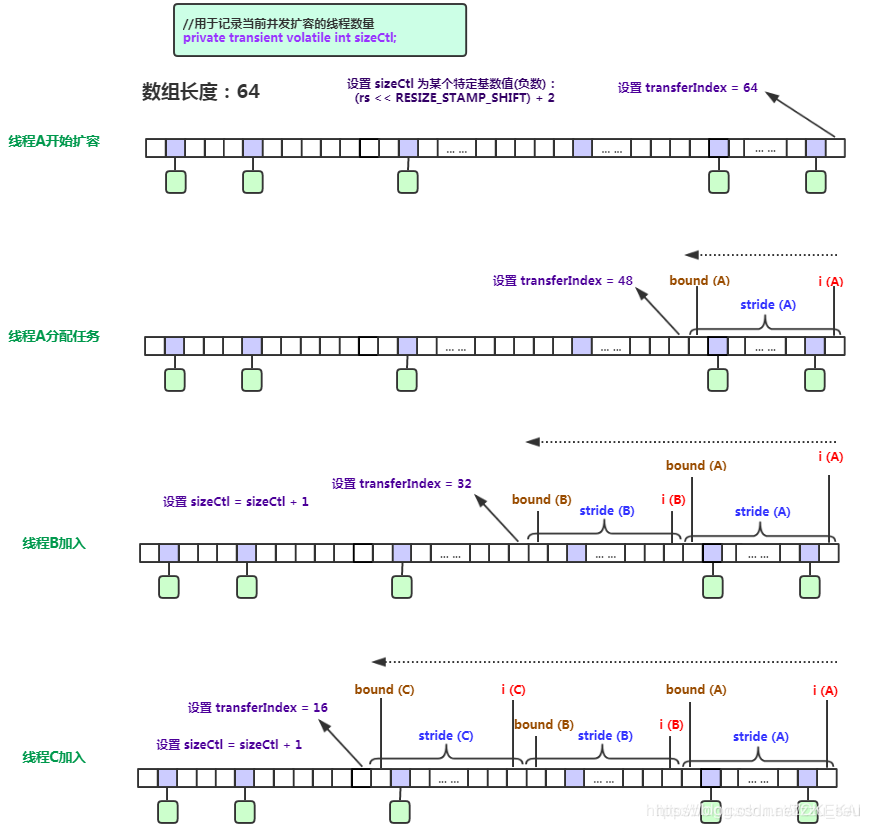

# ConcurrentHashMap源码解析
## 结构

## 结点类型
- Node<K,V> implements Map.Entry<K,V> 普通结点
- ForwardingNode<K,V> extends Node<K,V> 迁移操作期间bin头结点，下文中简称转发结点
- ReservationNode<K,V> extends Node<K,V> computeIfAbsent和compute方法使用的占位结点
- TreeBin<K,V> extends Node<K,V> 红黑树的包装结点，包含根节点等信息
- TreeNode<K,V> extends Node<K,V> TreeBin中使用的结点
## ConcurrentHashMap定义的主要字段
```java
    /**
     * The array of bins. Lazily initialized upon first insertion.
     * Size is always a power of two. Accessed directly by iterators.
     */
    transient volatile Node<K,V>[] table;

    /**
     * The next table to use; non-null only while resizing.
     */
    private transient volatile Node<K,V>[] nextTable;

    /**
     * Base counter value, used mainly when there is no contention,
     * but also as a fallback during table initialization
     * races. Updated via CAS.
     */
    private transient volatile long baseCount;

    /**
     * Table initialization and resizing control.  When negative, the
     * table is being initialized or resized: -1 for initialization,
     * else -(1 + the number of active resizing threads).  Otherwise,
     * when table is null, holds the initial table size to use upon
     * creation, or 0 for default. After initialization, holds the
     * next element count value upon which to resize the table.
     */
    private transient volatile int sizeCtl; // 表初始化及扩容时的控制参数

    /**
     * The next table index (plus one) to split while resizing.
     */
    private transient volatile int transferIndex; // 扩容索引

    /**
     * Spinlock (locked via CAS) used when resizing and/or creating CounterCells.
     */
    private transient volatile int cellsBusy;

    /**
     * Table of counter cells. When non-null, size is a power of 2.
     */
    private transient volatile CounterCell[] counterCells; // 和size计算有关

    // views
    private transient KeySetView<K,V> keySet;
    private transient ValuesView<K,V> values;
    private transient EntrySetView<K,V> entrySet;
```
其中sizeCtl含义比较复杂：
- -1 ：表示正在初始化
- -(1+n): n表示扩容线程的数量
- 0： 表未初始化，默认值
- n: 表示下次扩容的大小

在ConcurrentHashMap中定义了几个特殊的哈希值：
- -1 转发结点的哈希值
- -2 树的根结点的哈希值
- -3 computeIfAbsent和compute方法中用到的占位结点的哈希值
```java
    static final int MOVED     = -1; // hash for forwarding nodes
    static final int TREEBIN   = -2; // hash for roots of trees
    static final int RESERVED  = -3; // hash for transient reservations
```
## 构造函数
```java
    public ConcurrentHashMap(int initialCapacity,
                             float loadFactor, int concurrencyLevel) {
        if (!(loadFactor > 0.0f) || initialCapacity < 0 || concurrencyLevel <= 0)
            throw new IllegalArgumentException();
        if (initialCapacity < concurrencyLevel)   // Use at least as many bins
            initialCapacity = concurrencyLevel;   // as estimated threads
        // 与HashMap的初始化容量有细微差别，多了下面这一行
        long size = (long)(1.0 + (long)initialCapacity / loadFactor);
        int cap = (size >= (long)MAXIMUM_CAPACITY) ?
            MAXIMUM_CAPACITY : tableSizeFor((int)size);
        this.sizeCtl = cap;
    }
```
tableSizeFor计算了比cap大的最小2次幂，算法非常巧妙，通过 n | n >>> 1 将第一个高位的1扩展到与它右侧相邻的位也是1，得到11******这样形式的二进制数，然后再继续向低位扩展。
```java
    static final int tableSizeFor(int cap) {
        // 如果不减一，当前cap恰好是2的次幂，最终得到的结果就会是cap*2，而不是cap了
        int n = cap - 1; 
        n |= n >>> 1; // 1个高位1 => 2个高位1
        n |= n >>> 2; // 2个高位1 => 4个高位1
        n |= n >>> 4; 
        n |= n >>> 8;
        n |= n >>> 16;
        return (n < 0) ? 1 : (n >= MAXIMUM_CAPACITY) ? MAXIMUM_CAPACITY : n + 1;
    }
```
以cap=10为例，其运算过程如下：

## 初始化 initTable
initTable并没有在构造器中直接完成初始化，而是在putVal、merge、computeIfAbsent、
computeIfPresent、compute等元素操作时才进行初始化。
```java
    /**
     * Initializes table, using the size recorded in sizeCtl.
     */
    private final Node<K,V>[] initTable() {
        Node<K,V>[] tab; int sc;
        while ((tab = table) == null || tab.length == 0) {
            // 如果sizeCtl小于0，表示正在初始化或者正在扩容，因此不再竞争，仅自旋
            if ((sc = sizeCtl) < 0)
                Thread.yield(); // lost initialization race; just spin
            // 否则，通过CAS操作，将sizeCtl设置为-1
            else if (U.compareAndSwapInt(this, SIZECTL, sc, -1)) {
                try {
                    if ((tab = table) == null || tab.length == 0) {
                        int n = (sc > 0) ? sc : DEFAULT_CAPACITY;
                        @SuppressWarnings("unchecked")
                        // 初始化一个长度为n的数组
                        Node<K,V>[] nt = (Node<K,V>[])new Node<?,?>[n];
                        table = tab = nt;
                        // 指定下次扩容的长度，相当于 0.75 × n
                        sc = n - (n >>> 2);
                    }
                } finally {
                    sizeCtl = sc;
                }
                break;
            }
        }
        return tab;
    }
```
## 几个工具方法
```java
    // 获取表中下标为i的头结点，也就是第i个桶，依赖Unsafe
    static final <K,V> Node<K,V> tabAt(Node<K,V>[] tab, int i) {
        return (Node<K,V>)U.getObjectVolatile(tab, ((long)i << ASHIFT) + ABASE);
    }
    // 通过CAS操作设置表中下标为i的头结点为v
    static final <K,V> boolean casTabAt(Node<K,V>[] tab, int i,
                                        Node<K,V> c, Node<K,V> v) {
        return U.compareAndSwapObject(tab, ((long)i << ASHIFT) + ABASE, c, v);
    }
    // 直接设置表中下标i的头结点为v
    static final <K,V> void setTabAt(Node<K,V>[] tab, int i, Node<K,V> v) {
        U.putObjectVolatile(tab, ((long)i << ASHIFT) + ABASE, v);
    }
```
## 基本操作
### get
```java
    public V get(Object key) {
        Node<K,V>[] tab; Node<K,V> e, p; int n, eh; K ek;
        // 计算hash值
        int h = spread(key.hashCode());
        if ((tab = table) != null && (n = tab.length) > 0 &&
            // 获取表中下标为(n - 1) & h的头结点
            (e = tabAt(tab, (n - 1) & h)) != null) {
            // 头结点hash值相同
            if ((eh = e.hash) == h) {
                // 再对比key是否相同
                if ((ek = e.key) == key || (ek != null && key.equals(ek)))
                    return e.val;
            }
            // 头结点hash小于0, 说明是ForwardingNode、TreeBin、ReservationNode。
            // 各类型的结点重写了Node的find方法，根据结点的类型，查找方式不同
            else if (eh < 0)
                return (p = e.find(h, key)) != null ? p.val : null;
            // 其他情况，那就是一个普通结点链表，遍历查找即可
            while ((e = e.next) != null) {
                if (e.hash == h &&
                    ((ek = e.key) == key || (ek != null && key.equals(ek))))
                    return e.val;
            }
        }
        return null;
    }
```
get流程：
1. 计算hash值
2. 定位到桶
3. 头结点是否要找到结点
4. 头结点hash值小于0，按各类型Node进行查找
5. 头结点是普通结点，遍历查找

### put
```java
    public V put(K key, V value) {
        return putVal(key, value, false);
    }

    /** Implementation for put and putIfAbsent */
    final V putVal(K key, V value, boolean onlyIfAbsent) {
        // ConcurrentHashMap中key、value均不支持null
        if (key == null || value == null) throw new NullPointerException();
        // 不是单纯的使用hashCode，而是将高16位也参与到hash值的计算
        // 高16位与低16位异或，并强制最高位为0(消除符号位)
        // (h ^ (h >>> 16)) & HASH_BITS
        int hash = spread(key.hashCode());
        int binCount = 0;
        for (Node<K,V>[] tab = table;;) {
            Node<K,V> f; int n, i, fh;
            // 如果表未初始化，就先进行初始化
            if (tab == null || (n = tab.length) == 0)
                tab = initTable();
            // 定位到表中的桶 (n - 1) & hash
            // 如果当前这个桶还没有结点，则创建一个结点，并通过CAS设置结点，完成添加
            else if ((f = tabAt(tab, i = (n - 1) & hash)) == null) {
                // CAS将bin头结点设置为插入的结点
                if (casTabAt(tab, i, null,
                             new Node<K,V>(hash, key, value, null)))
                    break;                   // no lock when adding to empty bin
            }
            // 如果当前桶有结点，同时该桶正在进行扩容转移，则当前线程加入扩容队伍中，帮助扩容
            else if ((fh = f.hash) == MOVED)
                tab = helpTransfer(tab, f);
            // 遍历链表或树，插入结点
            else {
                V oldVal = null;
                // 将头结点加锁
                synchronized (f) {
                    // 双重确认头结点是否有变动
                    if (tabAt(tab, i) == f) {
                        // 哈希值为正整数，表示这是个链表，遍历链表
                        if (fh >= 0) {
                            binCount = 1;
                            for (Node<K,V> e = f;; ++binCount) {
                                K ek;
                                // 链表中已经有key相同的结点了，就替换原值
                                if (e.hash == hash &&
                                    ((ek = e.key) == key ||
                                     (ek != null && key.equals(ek)))) {
                                    oldVal = e.val;
                                    if (!onlyIfAbsent)
                                        e.val = value;
                                    break;
                                }
                                // 遍历到头了，没有与当前key相同的结点，插入新的结点
                                Node<K,V> pred = e;
                                if ((e = e.next) == null) {
                                    pred.next = new Node<K,V>(hash, key,
                                                              value, null);
                                    break;
                                }
                            }
                        }
                        // 如果头结点是TreeBin
                        else if (f instanceof TreeBin) {
                            Node<K,V> p;
                            binCount = 2;
                            if ((p = ((TreeBin<K,V>)f).putTreeVal(hash, key,
                                                           value)) != null) {
                                oldVal = p.val;
                                if (!onlyIfAbsent)
                                    p.val = value;
                            }
                        }
                    }
                }
                if (binCount != 0) {
                    // 如果链表长度大于8,转换为树
                    if (binCount >= TREEIFY_THRESHOLD)
                        treeifyBin(tab, i);
                    if (oldVal != null)
                        return oldVal;
                    break;
                }
            }
        }
        addCount(1L, binCount);
        return null;
    }
```
put的流程：
1. 计算hash值
2. 如果hash表还没初始化，初始化hash表
3. 如果定位到的桶还没有头结点，CAS设置头结点
4. 如果发现定位的桶中头结点hash是MOVED(-1，表示已迁移)，那当前线程就去帮助扩容
5. 如果定位的桶，头结点hash值不是MOVED，锁住头结点，头结点可能是普通结点或者TreeBin，分情况遍历插入结点
6. 计数，同时看是否触发了扩容
#### 帮助扩容 helpTransfer
```java
    /**
     * Helps transfer if a resize is in progress.
     */
    final Node<K,V>[] helpTransfer(Node<K,V>[] tab, Node<K,V> f) {
        Node<K,V>[] nextTab; int sc;
        // 当前结点为转移中的结点，并且转移结点中的nextTable不为空
        if (tab != null && (f instanceof ForwardingNode) &&
            (nextTab = ((ForwardingNode<K,V>)f).nextTable) != null) {
            // rs: 容量数据校验标识
            int rs = resizeStamp(tab.length);
            // sizeCtl小于0
            while (nextTab == nextTable && table == tab &&
                   (sc = sizeCtl) < 0) {
                // 1. 对容量数据进行校验，sizeCtl的容量是否和实际表的容量一致
                // 2. 进行sc的最小值或最大值判断
                // 3. 确保tranfer()中的nextTable相关初始化逻辑已走完
                if ((sc >>> RESIZE_STAMP_SHIFT) != rs || sc == rs + 1 ||
                    sc == rs + MAX_RESIZERS || transferIndex <= 0)
                    break;
                // CAS操作设置sizectl+1，并加入扩容队伍
                if (U.compareAndSwapInt(this, SIZECTL, sc, sc + 1)) {
                    transfer(tab, nextTab);
                    break;
                }
            }
            return nextTab;
        }
        return table;
    }
```
#### addCount
addCount的作用
- count
- 检查是否触发扩容条件
```java
    /**
     * Adds to count, and if table is too small and not already
     * resizing, initiates transfer. If already resizing, helps
     * perform transfer if work is available.  Rechecks occupancy
     * after a transfer to see if another resize is already needed
     * because resizings are lagging additions.
     *
     * @param x the count to add
     * @param check if <0, don't check resize, if <= 1 only check if uncontended
     */
    private final void addCount(long x, int check) {
        CounterCell[] as; long b, s;
        // 如果计数盒子不为空，或者CAS更新baseCount+x不成功
        if ((as = counterCells) != null ||
            !U.compareAndSwapLong(this, BASECOUNT, b = baseCount, s = b + x)) {
            CounterCell a; long v; int m;
            boolean uncontended = true;
            // 计数盒子为空
            // 随机取一个盒子，却为空
            // CAS更新随机盒子的值却失败了（出现了并发）
            // 执行fullAddCount，结束
            if (as == null || (m = as.length - 1) < 0 ||
                (a = as[ThreadLocalRandom.getProbe() & m]) == null ||
                !(uncontended =
                  U.compareAndSwapLong(a, CELLVALUE, v = a.value, v + x))) {
                fullAddCount(x, uncontended);
                return;
            }
            if (check <= 1)
                return;
            s = sumCount();
        }
        // 检查是否需要进行扩容
        if (check >= 0) {
            Node<K,V>[] tab, nt; int n, sc;
            // s是当前元素个数
            // 1. 如果当前元素个数大于等于sizeCtl（下次扩容的大小）
            // 2. hash表不为空
            // 3. 当前hash表长度小于最大容量
            while (s >= (long)(sc = sizeCtl) && (tab = table) != null &&
                   (n = tab.length) < MAXIMUM_CAPACITY) {
                // 计算当前hash表长度n的数据校验标识
                int rs = resizeStamp(n);
                // 如果sizeCtl小于0，说明，正在扩容或初始化
                if (sc < 0) {
                    // 1. 如果sizeCtl高位数据校验不等于rs
                    // 2. 最小值最大值校验，MAX_RESIZERS = (1 << (32 - RESIZE_STAMP_BITS)) - 1
                    // 3. nextTable即扩容表是否为空
                    // 4. transferIndex，即扩容索引是否已经到边界
                    if ((sc >>> RESIZE_STAMP_SHIFT) != rs || sc == rs + 1 ||
                        sc == rs + MAX_RESIZERS || (nt = nextTable) == null ||
                        transferIndex <= 0)
                        break;
                    // 加入扩容
                    if (U.compareAndSwapInt(this, SIZECTL, sc, sc + 1))
                        transfer(tab, nt);
                }
                // 第一个线程加入扩容时，初始化sizeCtl为(rs << RESIZE_STAMP_SHIFT) + 2))
                else if (U.compareAndSwapInt(this, SIZECTL, sc,
                                             (rs << RESIZE_STAMP_SHIFT) + 2))
                    transfer(tab, null);
                s = sumCount();
            }
        }
    }
```
baseCount是没有竞争的情况下，更新的基础计数值。
counterCells，计数盒子，在有竞争的情况下，当前线程随机选取一个盒子，更新盒子的计数。
```java
    public int size() {
        long n = sumCount();
        return ((n < 0L) ? 0 :
                (n > (long)Integer.MAX_VALUE) ? Integer.MAX_VALUE :
                (int)n);
    }
    final long sumCount() {
        CounterCell[] as = counterCells; CounterCell a;
        long sum = baseCount;
        if (as != null) {
            for (int i = 0; i < as.length; ++i) {
                if ((a = as[i]) != null)
                    sum += a.value;
            }
        }
        return sum;
    }
```
size方法，通过baseCount+各计数盒子的计数值来得到表中元素总数。
#### tryPresize
tryPresize：在putAll、treeifyBin时调用
```java
    /**
     * Tries to presize table to accommodate the given number of elements.
     *
     * @param size number of elements (doesn't need to be perfectly accurate)
     */
    // 尝试预调整表的大小，以容纳给定数量的元素
    private final void tryPresize(int size) {
        // 计算调整后的容量
        int c = (size >= (MAXIMUM_CAPACITY >>> 1)) ? MAXIMUM_CAPACITY :
            tableSizeFor(size + (size >>> 1) + 1);
        int sc;
        // sizeCtl>=0表示没有在扩容或初始化
        while ((sc = sizeCtl) >= 0) {
            Node<K,V>[] tab = table; int n;
            // 如果表还是空的，初始化
            if (tab == null || (n = tab.length) == 0) {
                // 取原sizeCtl、调整后容量较大者，进行初始化
                n = (sc > c) ? sc : c;
                if (U.compareAndSwapInt(this, SIZECTL, sc, -1)) {
                    try {
                        if (table == tab) {
                            @SuppressWarnings("unchecked")
                            Node<K,V>[] nt = (Node<K,V>[])new Node<?,?>[n];
                            table = nt;
                            sc = n - (n >>> 2);
                        }
                    } finally {
                        sizeCtl = sc;
                    }
                }
            }
            // 如果调整后的容量小于等于原sizeCtl，或者当前表长度大于等于最大容量，不进行任何操作
            else if (c <= sc || n >= MAXIMUM_CAPACITY)
                break;
            // 二次校验，table有没有变化，没有变化
            else if (tab == table) {
                // 计算容量校验rs
                int rs = resizeStamp(n);
                // 如果正在进行扩容
                if (sc < 0) {
                    Node<K,V>[] nt;
                    // 进行一些扩容前的校验
                    // 1. 容量校验
                    // 2. 最小值、最大值校验
                    // 3. nexttable校验
                    // 4. 扩容索引校验
                    if ((sc >>> RESIZE_STAMP_SHIFT) != rs || sc == rs + 1 ||
                        sc == rs + MAX_RESIZERS || (nt = nextTable) == null ||
                        transferIndex <= 0)
                        break;
                    // CAS操作设置sizeCtl为 sizeCtl+1，并加入扩容队伍
                    if (U.compareAndSwapInt(this, SIZECTL, sc, sc + 1))
                        transfer(tab, nt);
                }
                // CAS操作，设置sizeCtl为(rs << RESIZE_STAMP_SHIFT) + 2))，并加入扩容
                else if (U.compareAndSwapInt(this, SIZECTL, sc,
                                             (rs << RESIZE_STAMP_SHIFT) + 2))
                    transfer(tab, null);
            }
        }
    }
```
rs与RESIZE_STAMP_SHIFT配合可以求出新的sizeCtl的值，分情况如下：
- sc < 0
已经有线程在扩容，将sizeCtl+1并调用transfer()让当前线程参与扩容。
- sc >= 0
表示没有线程在扩容，使用CAS将sizeCtl的值改为(rs << RESIZE_STAMP_SHIFT) + 2)。

简单来说，sc = (rs << RESIZE_STAMP_SHIFT) + 2)，sc的高16位表示数据校验标识，低16位表示多少个线程正在执行扩容操作。
```java
    static final int resizeStamp(int n) {
        return Integer.numberOfLeadingZeros(n) | (1 << (RESIZE_STAMP_BITS - 1));
    }
```

rs即resizeStamp(n)，将n转换为形式如0000 0000 0000 0000 1xxx xxx xxxx xxxx。
其中高16位为0，第16位为1，低15位标识容量n的数据校验标识。

记temp=rs << RESIZE_STAMP_SHIFT。如当前容量为8时rs的值：

//rs

0000 0000 0000 0000 1000 0000 0000 1000

//temp = rs << RESIZE_STAMP_SHIFT，即 temp = rs << 16，左移16后temp最高位为1，所以temp成了一个负数。

1000 0000 0000 1000 0000 0000 0000 0000

//sc = (rs << RESIZE_STAMP_SHIFT) + 2)

1000 0000 0000 1000 0000 0000 0000 0010

那么sizeCtl: 高15位为容量n的数据校验标识 ，低16位为并行扩容线程数+1

在第一个线程要对hash表进行扩容之前，sizeCtl的值肯定大于等于0的，而第一个线程要执行扩容时，把sizeCtl设置为(rs << RESIZE_STAMP_SHIFT) + 2))，这是一个比较大的负数，而之后有新加入扩容的线程时，将sizeCtl+1，之后有线程结束扩容，则sizeCtl-1，最终所有扩容任务完成时sizeCtrl还是(rs << RESIZE_STAMP_SHIFT) + 2))

## 扩容 transfer
```java
    private final void transfer(Node<K,V>[] tab, Node<K,V>[] nextTab) {
        // hash表容量n, 步长stride
        int n = tab.length, stride;
        // 计算步长：如果是多核的话，取(n >>> 3) / NCPU，否则取n
        if ((stride = (NCPU > 1) ? (n >>> 3) / NCPU : n) < MIN_TRANSFER_STRIDE)
            stride = MIN_TRANSFER_STRIDE; // subdivide range
        // 初始化nextTab
        if (nextTab == null) {            // initiating
            try {
                @SuppressWarnings("unchecked")
                // 创建一个长度为2n的Node数组，作为nextTab
                Node<K,V>[] nt = (Node<K,V>[])new Node<?,?>[n << 1];
                nextTab = nt;
            } catch (Throwable ex) {      // try to cope with OOME
                sizeCtl = Integer.MAX_VALUE;
                return;
            }
            nextTable = nextTab;
            transferIndex = n; //扩容总进度，>=transferIndex的桶都已分配出去
        }
        // 扩容后的容量nextn
        int nextn = nextTab.length;
        // 转发结点，其hash值为MOVED(-1)
        ForwardingNode<K,V> fwd = new ForwardingNode<K,V>(nextTab);
        // 标记一个结点是否迁移完成
        boolean advance = true;
        // 标记所有桶是否都迁移完成
        boolean finishing = false; // to ensure sweep before committing nextTab
        for (int i = 0, bound = 0;;) {
            Node<K,V> f; int fh;
            // 1. 基于CAS计算本次任务的边界值，即i和bound值
            // i最终指向transferIndex,bound指向transferIndex-stride
            while (advance) {
                int nextIndex, nextBound;
                // 标记当前结点迁移完成
                if (--i >= bound || finishing)
                    advance = false;
                // transferIndex<=0，表示所有任务已经分配给相应的线程进行处理
                else if ((nextIndex = transferIndex) <= 0) {
                    i = -1;
                    advance = false;
                }
                // CAS操作，设置transferIndex为transferIndex-stride，nextBound 是本次任务的边界
                else if (U.compareAndSwapInt
                         (this, TRANSFERINDEX, nextIndex,
                          nextBound = (nextIndex > stride ?
                                       nextIndex - stride : 0))) {
                    bound = nextBound;
                    i = nextIndex - 1;
                    advance = false;
                }
            }
            // 2. 执行迁移
            // 当前线程自己的任务已经完成或所有线程的任务都已完成
            // 第二与第三个条件应该是下面让"i = n"后，二次检查
            if (i < 0 || i >= n || i + n >= nextn) {
                int sc;
                // 所有迁移任务已经完成
                if (finishing) {
                    nextTable = null;
                    // 更新hash表为nextTab
                    table = nextTab;
                    // 更新sizeCtl为表长的1.5倍？
                    sizeCtl = (n << 1) - (n >>> 1);
                    return;
                }
                // 当前任务完成的话，置sizeCtl - 1 
                if (U.compareAndSwapInt(this, SIZECTL, sc = sizeCtl, sc - 1)) {
                    // 当前任务完成，但整体还没完成
                    if ((sc - 2) != resizeStamp(n) << RESIZE_STAMP_SHIFT)
                        return;
                    // 此时 sizeCtl == (rs << RESIZE_STAMP_SHIFT) + 2，说明所有的任务都执行完了
                    finishing = advance = true;
                    i = n; // recheck before commit
                }
            }
            // 如果这个结点为空，直接置一个空的fwd结点
            else if ((f = tabAt(tab, i)) == null)
                advance = casTabAt(tab, i, null, fwd);
            // 如果这个结点已经迁移
            else if ((fh = f.hash) == MOVED)
                advance = true; // already processed
            // 对当前结点迁移
            else {
                synchronized (f) {
                    // 二次确认结点是否当前结点
                    if (tabAt(tab, i) == f) {
                        Node<K,V> ln, hn;
                        // hash值大于等于0，正常的链表
                        if (fh >= 0) {
                            // 由于n是2的幂次方（所有二进制位中只有一个1)，
                            // 如n=16(0001 0000)，第5位为1，那么hash&n后的值第5位只能为0或1。
                            // 所以可以根据hash&n的结果将所有结点分为两部分。
                            int runBit = fh & n;
                            Node<K,V> lastRun = f;
                            // 找到最后一段fh&n不变的链表，这段链表可直接复用
                            for (Node<K,V> p = f.next; p != null; p = p.next) {
                                int b = p.hash & n;
                                if (b != runBit) {
                                    runBit = b;
                                    lastRun = p;
                                }
                            }
                            // 0，最终接在扩容后的低位上
                            if (runBit == 0) {
                                ln = lastRun;
                                hn = null;
                            }
                            // 1，最终接在扩容后的高位上
                            else {
                                hn = lastRun;
                                ln = null;
                            }
                            // 对lastRun之前的结点，因为不确定最终在哪个链表中，遍历，一一确认
                            for (Node<K,V> p = f; p != lastRun; p = p.next) {
                                int ph = p.hash; K pk = p.key; V pv = p.val;
                                if ((ph & n) == 0)
                                    ln = new Node<K,V>(ph, pk, pv, ln);
                                else
                                    hn = new Node<K,V>(ph, pk, pv, hn);
                            }
                            // 扩容后的低位链表
                            setTabAt(nextTab, i, ln);
                            // 扩容后的高位链表
                            setTabAt(nextTab, i + n, hn);
                            // 扩容后，原表中表头置为fwd，提示该桶扩容完成
                            setTabAt(tab, i, fwd);
                            advance = true;
                        }
                        // 如果是红黑树
                        else if (f instanceof TreeBin) {
                            TreeBin<K,V> t = (TreeBin<K,V>)f;
                            TreeNode<K,V> lo = null, loTail = null;
                            TreeNode<K,V> hi = null, hiTail = null;
                            int lc = 0, hc = 0;
                            for (Node<K,V> e = t.first; e != null; e = e.next) {
                                int h = e.hash;
                                TreeNode<K,V> p = new TreeNode<K,V>
                                    (h, e.key, e.val, null, null);
                                if ((h & n) == 0) {
                                    if ((p.prev = loTail) == null)
                                        lo = p;
                                    else
                                        loTail.next = p;
                                    loTail = p;
                                    ++lc;
                                }
                                else {
                                    if ((p.prev = hiTail) == null)
                                        hi = p;
                                    else
                                        hiTail.next = p;
                                    hiTail = p;
                                    ++hc;
                                }
                            }
                            // 拆分后的树结点小于6个，转成链表
                            ln = (lc <= UNTREEIFY_THRESHOLD) ? untreeify(lo) :
                                (hc != 0) ? new TreeBin<K,V>(lo) : t;
                            hn = (hc <= UNTREEIFY_THRESHOLD) ? untreeify(hi) :
                                (lc != 0) ? new TreeBin<K,V>(hi) : t;
                            setTabAt(nextTab, i, ln);
                            setTabAt(nextTab, i + n, hn);
                            setTabAt(tab, i, fwd);
                            advance = true;
                        }
                    }
                }
            }
        }
    }
```

transfer的流程：
1. nextTable是否初始化，没有就进行初始化
2. 执行迁移
    - 分配一个区间
    - 正式迁移
        - 迁移任务有没有完成
        - 头结点为空，直接置一个fwd结点
        - 如果已经是一个fwd，说明正在迁移，再去请求分配
        - 执行迁移操作



## 参考文献
1. https://stackoverflow.com/questions/47175835/how-does-concurrenthashmap-resizestamp-method-work
2. https://blog.csdn.net/zzu_seu/article/details/106698150
3. https://www.zhenchao.org/2019/01/31/java/cas-based-concurrent-hashmap/