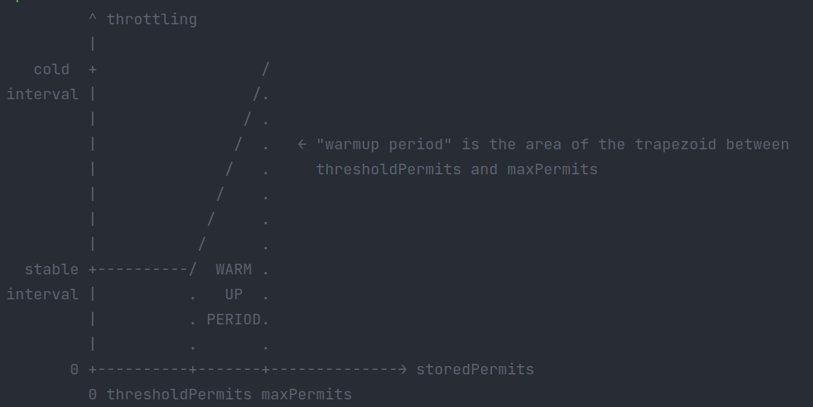

# RateLimiter

```text
      RateLimiter
          ^
          |
  SmoothRateLimiter
      ^         ^
      |         |
SmoothBursty SmoothWarmingUp
```

## RateLimiter使用示例

* 有一些任务要执行，但不希望每秒提交任务多于2个
* 数据流，每秒获取5kb

## 限流模式

* 稳定模式（SmoothBursty: 令牌生成速度恒定）
* 渐进模式（SmoothWarmingUp：令牌生成速度缓慢提升直到维持在一个稳定值）

## 源码解析

```java
  @VisibleForTesting
  static RateLimiter create(double permitsPerSecond, SleepingStopwatch stopwatch) {
    RateLimiter rateLimiter = new SmoothBursty(stopwatch, 1.0 /* maxBurstSeconds */);
    rateLimiter.setRate(permitsPerSecond);
    return rateLimiter;
  }

  @VisibleForTesting
  static RateLimiter create(
      double permitsPerSecond,
      long warmupPeriod,
      TimeUnit unit,
      double coldFactor,
      SleepingStopwatch stopwatch) {
    RateLimiter rateLimiter = new SmoothWarmingUp(stopwatch, warmupPeriod, unit, coldFactor);
    rateLimiter.setRate(permitsPerSecond);
    return rateLimiter;
  }
```

```java
  // 请求令牌
  @CanIgnoreReturnValue
  public double acquire(int permits) {
    // 计算请求这么多个令牌需要等待多久。
    long microsToWait = reserve(permits);
    // 进行睡眠等待
    stopwatch.sleepMicrosUninterruptibly(microsToWait);
    // 返回等待时间
    return 1.0 * microsToWait / SECONDS.toMicros(1L);
  }
  // 计算请求这么多令牌需要等待多久
  final long reserve(int permits) {
    // 校验参数合法性
    checkPermits(permits);
    // 获取锁（mutex()方法中用双重检查锁生成一个单例对象）
    synchronized (mutex()) {
      return reserveAndGetWaitLength(permits, stopwatch.readMicros());
    }
  }
  // 计算请求这些令牌需要等待多久
  final long reserveAndGetWaitLength(int permits, long nowMicros) {
    // 该方法在子类SmoothRateLimiter中实现
    long momentAvailable = reserveEarliestAvailable(permits, nowMicros);
    return max(momentAvailable - nowMicros, 0);
  }
```

### SmoothRateLimiter

```java
  @Override
  final long reserveEarliestAvailable(int requiredPermits, long nowMicros) {
    // 重置nextFreeTicketMicros和storedPremits参数
    resync(nowMicros);
    long returnValue = nextFreeTicketMicros;
    // 如果请求数量大于存储的数量，那就只能拿存储的数量
    double storedPermitsToSpend = min(requiredPermits, this.storedPermits);
    // 看有多少个令牌需要刷新等待，只有存储的令牌数量不足以满足请求数量时，才需要预支
    double freshPermits = requiredPermits - storedPermitsToSpend;
    // storedPermitsToWaitTime方法在两种限流模式中各有实现
    // SmoothBursty模式中为0
    // SmmothWarmingUp模式具体参照下文
    long waitMicros =
        storedPermitsToWaitTime(this.storedPermits, storedPermitsToSpend)
            + (long) (freshPermits * stableIntervalMicros);
    // SmmothWarmingUp模式下需要等待的时间以及预支的令牌等待时间延迟至下一次令牌请求
    this.nextFreeTicketMicros = LongMath.saturatedAdd(nextFreeTicketMicros, waitMicros);
    // 更新存储的令牌数量
    this.storedPermits -= storedPermitsToSpend;
    return returnValue;
  }
```

```java
  void resync(long nowMicros) {
    // if nextFreeTicket is in the past, resync to now
    // 如果nextFreeTicket在过去，将它重置为nowMicros
    if (nowMicros > nextFreeTicketMicros) {
      // [nextFreeTicketMicros, nowMicros]这段时间可以生成多少个令牌
      double newPermits = (nowMicros - nextFreeTicketMicros) / coolDownIntervalMicros();
      storedPermits = min(maxPermits, storedPermits + newPermits);
      nextFreeTicketMicros = nowMicros;
    }
  }
```

### SmoothWarmingUp



```java
    // 当前令牌桶中存储的令牌数，本次请求要拿到令牌数
    @Override
    long storedPermitsToWaitTime(double storedPermits, double permitsToTake) {
      // 梯形区域可以拿到的令牌数  
      double availablePermitsAboveThreshold = storedPermits - thresholdPermits;
      long micros = 0;
      // measuring the integral on the right part of the function (the climbing line)
      // 如果梯形区域可以拿到的令牌数大于0，计算时间时需要把梯形区域的时间计算进去
      if (availablePermitsAboveThreshold > 0.0) {
        // 取梯形区域可以拿到的令牌数和要拿的令牌数的最小值
        double permitsAboveThresholdToTake = min(availablePermitsAboveThreshold, permitsToTake);
        // TODO(cpovirk): Figure out a good name for this variable.
        // 计算梯形面积，需要多少时间
        double length =
            permitsToTime(availablePermitsAboveThreshold)
                + permitsToTime(availablePermitsAboveThreshold - permitsAboveThresholdToTake);
        micros = (long) (permitsAboveThresholdToTake * length / 2.0);
        // 减去梯形区域可以拿到的令牌数，如果梯形区域不够，还要去平稳区域继续拿
        permitsToTake -= permitsAboveThresholdToTake;
      }
      // measuring the integral on the left part of the function (the horizontal line)
      micros += (long) (stableIntervalMicros * permitsToTake);
      return micros;
    }
```

