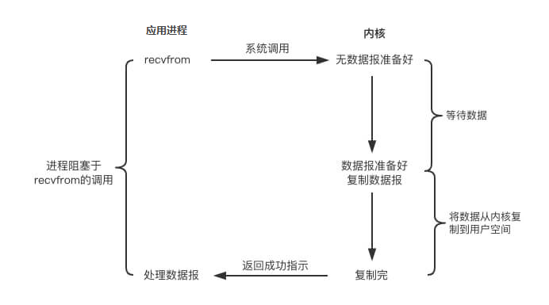
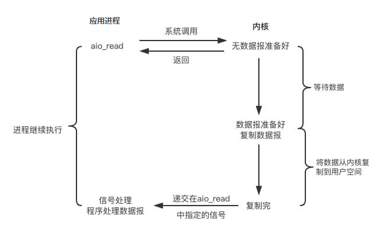

# I/O模型

## 同步与异步

## 阻塞与非阻塞

## 阻塞IO与非阻塞IO

IO操作：对硬盘的读写，对socket的读写，外设的读写
完整的IO读请求操作

1. 查看数据是否就绪
2. 进行数据拷贝（内核将数据拷贝到用户线程）

阻塞IO与非阻塞IO的区别在于第一个阶段。非阻塞IO，当数据没有就绪，read()方法会返回一个标志信息，告知当前线程数据没有就绪，而不是一直在那里等待

## 同步IO与异步IO

同步IO：当用户发出IO请求操作之后，如果数据没有就绪，需要通过用户线程或者内核不断地轮询数据是否就绪，当数据就绪时，再将数据从内核拷贝到用户线程

异步IO：只有IO请求操作是由用户线程来进行的，IO操作的两个阶段都是由<b>内核自动完成</b>，然后发送通知告知用户线程IO操作已完成。

同步IO与异步IO的关键区别：数据拷贝阶段是由用户线程完成还是由内核完成。

## 5种IO模型

### 阻塞IO模型

第1步和第2步都被阻塞

### 非阻塞IO模型

第1步不阻塞了，但是第2步还是阻塞的
轮询-> 系统调用

### 多路复用IO

解决无效的系统调用 -> select -> 连接数限制
连接数限制 -> select/poll -> 用户空间和内核空间之间，大量的数据拷贝、内核循环遍历IO状态，浪费CPU时间
存在无效的循环遍历 -> epoll

### 信号驱动IO

### 异步IO

### 几种IO模型的比较

