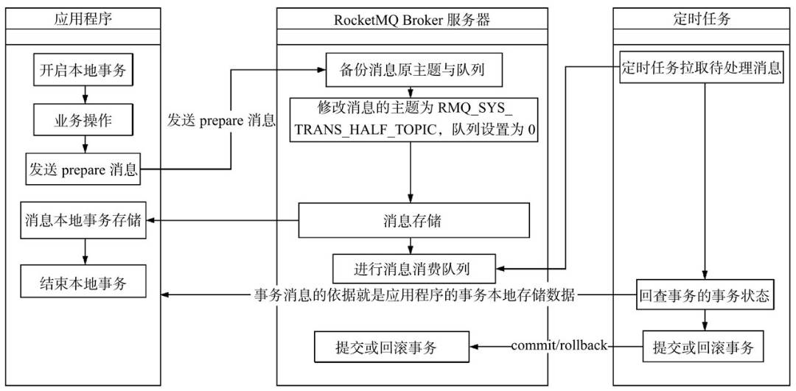
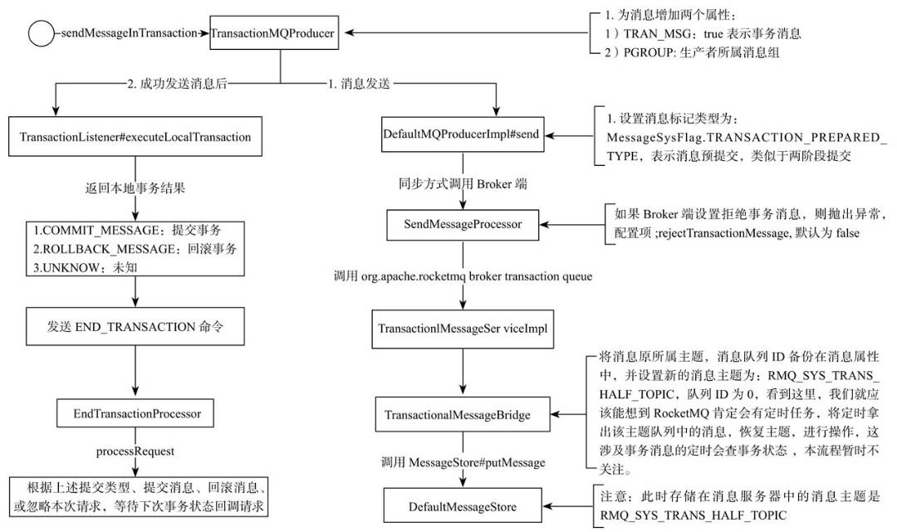

# RocketMQ 事务消息

## 适用场景
需要异步更新数据，并且对数据实时性要求不太高的场景

## 代码演示

事务示例相关文档详见 <https://rocketmq.apache.org/docs/transaction-example/>

### TranscationListener

这个接口主要包含两个接口，一个执行本地事务，一个检查本地事务状态

```java
// 执行本地事务
LocalTransactionState executeLocalTransaction(final Message msg, final Object arg);
// 检查本地事务状态
LocalTransactionState checkLocalTransaction(final MessageExt msg);
```

## 实现


利用事务反查机制解决了事务消息提交失败的问题。

1. MQ 发送方向 MQ Server 发送半消息
2. MQ Server 接收到半消息，则向 MQ 发送方返回发送成功
3. 执行本地事务
4. MQ 发送方向 MQ Server 提交或回滚半消息
5. MQ Server 未收到第4步中的确认时，回查事务状态
6. MQ 发送方检查本地事务的状态
7. 根据事务的状态提交或回滚
8. MQ Server 收到提交确认，则向 MQ 订阅方投递消息；否则删消息不进行投递

## 设计

1.事务消息在一阶段对用户不可见

在RocketMQ事务消息的主要流程中，一阶段的消息如何对用户不可见。其中，事务消息相对普通消息最大的特点就是一阶段发送的消息对用户是不可见的。
那么，如何做到写入消息但是对用户不可见呢？

RocketMQ事务消息的做法是：如果消息是half消息，将备份原消息的主题与消息消费队列，然后改变主题为RMQ_SYS_TRANS_HALF_TOPIC。由于消费组未订阅该主题，故消费端无法消费half类型的消息，然后RocketMQ会开启一个定时任务，从Topic为RMQ_SYS_TRANS_HALF_TOPIC中拉取消息进行消费，根据生产者组获取一个服务提供者发送回查事务状态请求，根据事务状态来决定是提交或回滚消息。

在RocketMQ中，消息在服务端的存储结构如下，每条消息都会有对应的索引信息，Consumer通过ConsumeQueue这个二级索引来读取消息实体内容，其流程如下：


RocketMQ的具体实现策略是：写入的如果事务消息，对消息的Topic和Queue等属性进行替换，同时将原来的Topic和Queue信息存储到消息的属性中，正因为消息主题被替换，故消息并不会转发到该原主题的消息消费队列，消费者无法感知消息的存在，不会消费。其实改变消息主题是RocketMQ的常用“套路”，延时消息的实现机制也是类似的。


2.Commit和Rollback操作以及Op消息的引入

在完成一阶段写入一条对用户不可见的消息后，二阶段如果是Commit操作，则需要让消息对用户可见；如果是Rollback则需要撤销一阶段的消息。

先说Rollback的情况。对于Rollback，本身一阶段的消息对用户是不可见的，其实不需要真正撤销消息（实际上RocketMQ也无法去真正的删除一条消息，因为是顺序写文件的）。

但是区别于这条消息没有确定状态（Pending状态，事务悬而未决），需要一个操作来标识这条消息的最终状态。RocketMQ事务消息方案中引入了Op消息的概念，用Op消息标识事务消息已经确定的状态（Commit或者Rollback）。如果一条事务消息没有对应的Op消息，说明这个事务的状态还无法确定（可能是二阶段失败了）。引入Op消息后，事务消息无论是Commit或者Rollback都会记录一个Op操作。

Commit相对于Rollback只是在写入Op消息前创建Half消息的索引。

3.Op消息的存储和对应关系

RocketMQ将Op消息写入到全局一个特定的Topic中通过源码中的方法—TransactionalMessageUtil.buildOpTopic()；这个Topic是一个内部的Topic（像Half消息的Topic一样），不会被用户消费。Op消息的内容为对应的Half消息的存储的Offset，这样通过Op消息能索引到Half消息进行后续的回查操作。


4.Half消息的索引构建

在执行二阶段Commit操作时，需要构建出Half消息的索引。一阶段的Half消息由于是写到一个特殊的Topic，所以二阶段构建索引时需要读取出Half消息，并将Topic和Queue替换成真正的目标的Topic和Queue，之后通过一次普通消息的写入操作来生成一条对用户可见的消息。所以RocketMQ事务消息二阶段其实是利用了一阶段存储的消息的内容，在二阶段时恢复出一条完整的普通消息，然后走一遍消息写入流程。

5.如何处理二阶段失败的消息？

如果在RocketMQ事务消息的二阶段过程中失败了，例如在做Commit操作时，出现网络问题导致Commit失败，那么需要通过一定的策略使这条消息最终被Commit。RocketMQ采用了一种补偿机制，称为“回查”。Broker端对未确定状态的消息发起回查，将消息发送到对应的Producer端（同一个Group的Producer），由Producer根据消息来检查本地事务的状态，进而执行Commit或者Rollback。Broker端通过对比Half消息和Op消息进行事务消息的回查并且推进CheckPoint（记录那些事务消息的状态是确定的）。

值得注意的是，rocketmq并不会无休止的的信息事务状态回查，默认回查15次，如果15次回查还是无法得知事务状态，rocketmq默认回滚该消息。

## 源码略读



### 发送事务消息

TransactionMQProducer#sendMessageInTransaction(final Message msg, final Object arg)

- DefaultMQProducerImpl#sendMessageInTransaction
  - 获取业务实现的TranscationListener，用于后续发送半消息成功之后执行本地事务
  - 半消息有一个特殊参数PROPERTY_TRANSACTION_PREPARED为true，用于标识半消息类型
  - 发送半消息
  - 如果发送成功，则执行本地事务；否则本地事务状态更新为回滚
  - 结束事务 endTranscation
    - 根据本地事务状态确定请求头参数为提交、回滚或未知，单向发送
  - 组装事务结果返回

### 处理事务消息

SendMessageProcessor#sendMessage

- TransactionalMessageServiceImpl#prepareMessage
  - TranscationMessageBridge#putHalfMessage
    - parseHalfMessageInner: 将真实的主题及队列ID放到参数里，将主题设置为半消息主题

### 处理提交或回滚

EndTranscationProcessor#processRequest



### 检查

TransactionalMessageCheckService#run
  - TranscationMessageServiceImpl#check

- 看半消息主题有没有队列
  - 没有，直接返回了
- 遍历队列
  - 拉一批消息
  - needDiscard: 判断当前检查次数是否已经超过最大检查次数，超过则丢弃该消息
  - needSkip: 半消息超过文件留存时间，跳过
  - 如果需要反查，则调用putBackHalfQueue再次写入Half topic，并异步进行反查

ClientRemotingProcessor#processRequest 会去调用发消息时实现的接口，反查本地事务状态


## 参考文献
1. <https://github.com/apache/rocketmq/blob/master/docs/cn/design.md>
2. RocketMQ设计内幕