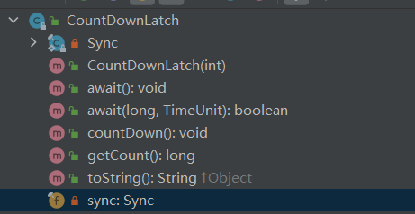

# Java中的并发工具类

## CountDownLatch

CountDownLatch运行一个或多个线程等待其他线程完成操作。

其原理是基于AQS，实现了tryAcquireShared和tryReleaseShared方法。使用AQS中的state作为计数器。



## CyclicBarrier

CyclicBarrier，让一组线程到达一个屏时被阻塞，直到最后一个线程到达屏障时，屏障才会开门，所有被屏障拦截的线程才能继续进行。

其实现原理是基于ReentrantLock及Condition。其结构中包含一个count，即屏障拦截的线程数量。

await、isBroken、reset等方法都是先获取锁再进行操作的。


在CyclicBarrier中有一个重要变量即generation，其类型是Generation。在每次屏障被打开或者reset时，generation就会改变。

```java

    /**
     * Each use of the barrier is represented as a generation instance.
     * The generation changes whenever the barrier is tripped, or
     * is reset. There can be many generations associated with threads
     * using the barrier - due to the non-deterministic way the lock
     * may be allocated to waiting threads - but only one of these
     * can be active at a time (the one to which {@code count} applies)
     * and all the rest are either broken or tripped.
     * There need not be an active generation if there has been a break
     * but no subsequent reset.
     */
    private static class Generation {
        boolean broken = false;
    }
```

下面的dowait是await方法依赖的内部方法，即其核心原理。

```java
    private int dowait(boolean timed, long nanos)
        throws InterruptedException, BrokenBarrierException,
               TimeoutException {
        final ReentrantLock lock = this.lock;
        // 加锁
        lock.lock();
        try {
            
            final Generation g = generation;

            // 当前generation是否被破坏了
            if (g.broken)
                throw new BrokenBarrierException();

            // 线程是否被中断过，如果中断过，则破坏屏障，并抛出中断异常
            if (Thread.interrupted()) {
                // 这里做的操作有
                // broken=true，count=parties，唤醒条件队列中的所有线程
                breakBarrier();
                throw new InterruptedException();
            }

            // 少了一个线程，count--
            int index = --count;
            // 如果这时候count=0了，说明屏障要等的所有线程都调用了await，这时可以执行后面的操作了
            if (index == 0) {  // tripped
                boolean ranAction = false;
                try {
                    // 如果barrierCommand不为空，优先执行这个命令
                    final Runnable command = barrierCommand;
                    if (command != null)
                        command.run();
                    ranAction = true;
                    nextGeneration();
                    return 0;
                } finally {
                    if (!ranAction)
                        breakBarrier();
                }
            }

            // loop until tripped, broken, interrupted, or timed out
            // 还没等到所有线程到达屏障
            for (;;) {
                try {
                    // 看是要直接等待，还是超时等待
                    if (!timed)
                        trip.await();
                    else if (nanos > 0L)
                        nanos = trip.awaitNanos(nanos);
                } catch (InterruptedException ie) {
                    // 当前线程在等待期间被中断则打破屏障，唤醒其他线程
                    if (g == generation && ! g.broken) {
                        breakBarrier();
                        throw ie;
                    } else {
                        // We're about to finish waiting even if we had not
                        // been interrupted, so this interrupt is deemed to
                        // "belong" to subsequent execution.
                        Thread.currentThread().interrupt();
                    }
                }
                // 如果线程因为打破屏障而被唤醒则抛出异常
                if (g.broken)
                    throw new BrokenBarrierException();

                // 如果当前线程因为换代操作而被唤醒则返回计数器的值
                if (g != generation)
                    return index;

                // 如果超时且超时时间小于0了，破坏屏障，并抛出超时异常
                if (timed && nanos <= 0L) {
                    breakBarrier();
                    throw new TimeoutException();
                }
            }
        } finally {
            lock.unlock();
        }
    }

```

### CyclicBarrier和CountDownLatch的区别

CountDownLatch的计数器只能使用一次，而CyclicBarrier计数器可以使用reset方法重置。所以CyclicBarrier非常适合业务场景复杂的情况。

## Semaphore

Semaphore信号量可用于做流量控制，特别是共用资源有限的场景，比如数据库连接。


